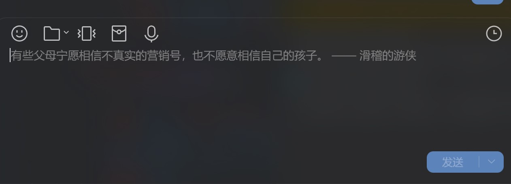
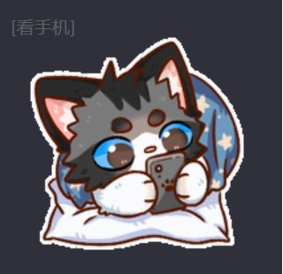
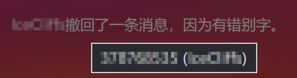
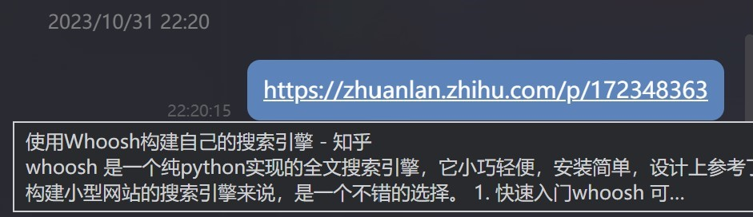
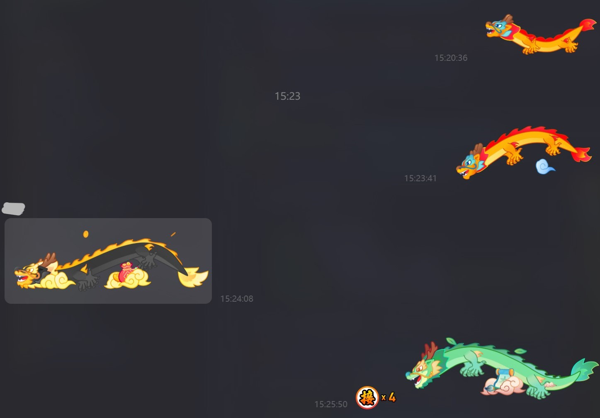
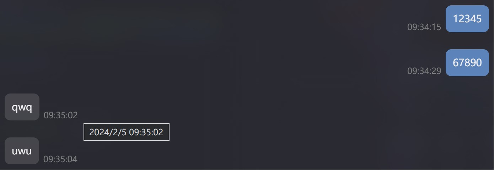

# Scriptio-user-scripts

我的 [Scriptio](https://github.com/PRO-2684/Scriptio) 用户脚本。

## [hitokoto](./hitokoto.js)

输入框占位符显示[一言](https://hitokoto.cn)，窗口隐藏或占位符不可见时不会刷新。实时响应。



## [hook-vue](./hook-vue.js)

Hook Vue 实例，使得可以通过 `el.__VUE__` 获取此元素所挂载的 Vue 实例，使用方法见代码注释。依赖此脚本的常用代码模板：

```javascript
// <脚本的简要说明>，需要 hook-vue.js 的支持
// @run-at <脚本启用页面>

(function () {
    const self = document.currentScript?.getAttribute("data-scriptio-script");
    let enabled = false;
    function process(component) {
        const el = component?.vnode?.el;
        // if (!el?.classList?.contains("message")) return; // 若仅需处理消息，可使用此行
        // <处理逻辑>
    }
    function enable() {
        if (enabled) return;
        window.__VUE_MOUNT__.push(process);
        // <启用脚本的额外工作>
        enabled = true;
    }
    function disable() {
        if (!enabled) return;
        const index = window.__VUE_MOUNT__.indexOf(process);
        if (index > -1) {
            window.__VUE_MOUNT__.splice(index, 1);
        }
        // <禁用脚本的额外工作>
        enabled = false;
    }
    if (window.__VUE_MOUNT__) {
        enable();
    } else {
        window.addEventListener("vue-hooked", enable, { once: true });
    }
    window.addEventListener("scriptio-toggle", (event) => {
        const path = event.detail.path;
        if (path === self) {
            if (event.detail.enabled) {
                enable();
            } else {
                disable();
            }
        }
    });
})();
```

**注意：可能与其他插件的类似功能冲突！**

## [hook-fetch](./hook-fetch.js)

Hook `fetch` 函数，从而可以通过 `window.__FETCH_HOOKS_BEFORE__` 和 `window.__FETCH_HOOKS_AFTER__` 添加请求前和请求后的处理函数。使用方法见代码注释。

## [img-quick-close](./img-quick-close.js)

查看图片时，单击窗口任意位置 (除功能按钮外) 即可关闭图片查看器。(类似于旧版本 QQ/微信)

## [inspectio](./inspectio.js)

添加各类提示信息，Ctrl+Click 可复制，包括：

- 被艾特的 QQ 号
- 表情/表情包/图片的摘要、长宽
    - 
- 图片文件名、尺寸、占用大小以及网址
- 视频文件名、时长以及占用大小
- 红包领取信息
- 语音消息的时长以及占用大小
- 小程序/卡片分享的摘要
    - Shift+Click 可复制小程序/卡片分享的代码
- 群公告展示完整内容
- 各类灰字提示中的 QQ 号
    - 撤回提示
    - 红包提示
    - 群成员变动提示
    - 禁言提示
- 撤回提示补全“自定义撤回消息”
    - 
- 查看过期的引用消息的发送者与时间
- 通话信息的时长 (精确到毫秒)

## [link-preview](./link-preview.js)

链接预览：鼠标经过链接时尝试加载浏览，悬浮显示链接的标题和描述，需要 hook-vue.js 的支持。*关闭/打开需要切换一次聊天窗口/重新进入聊天记录才能生效。*



## [msg-record-enhance](./msg-record-enhance.js)

查看转发的聊天记录中已知的和引用消息发送者 QQ，需要 hook-vue.js 的支持。鼠标悬浮在头像/引用消息的发送者昵称上时显示 QQ 号，双击可复制。*关闭/打开需要重新进入聊天记录才能生效。*

## [open-in-browser](./open-in-browser.js)

小程序若可行则浏览器打开。

原理：

- 若点击的小程序是已知可在浏览器打开的，则模拟右键，随后点击“使用浏览器打开”
    - 目前收集到的可在浏览器打开的：`com_tencent_miniapp_01` (Bilibili 分享?)
- 若失败，则退回至左键

## [plugin-icon](./plugin-icon.js)

设置界面展示插件图标（若有）。

## [privacio](./privacio.js)

保护你的隐私：通过拦截对特定域名的请求，从而阻止 QQ 的一些追踪行为，需要 hook-fetch.js 的支持。此脚本仅能阻止渲染层的追踪，无法阻止主进程的追踪。目前已知可以阻止的域名：

- `otheve.beacon.qq.com`
- `tpstelemetry.tencent.com`
- `h.trace.qq.com`
- `report.gamecenter.qq.com`

此脚本仅能拦截前三个，因为最后一个域名通常是主进程请求的。关于如何拦截列出的所有域名，详见 [此 Gist](https://gist.github.com/PRO-2684/4353310541c63fe7aef643d14bc92ff0)。

> [!NOTE]
> 您仍有可能在 chii DevTools 中看到一些 pending 的追踪请求，这是因为 chii DevTools 的工作方式，实际上用 Fiddler 等抓包工具可以得知它们确实被拦截了。

## [relay-self](./relay-self.js)

允许接龙自己的消息，需要 hook-vue.js 的支持



## [shortcutio](./shortcutio.js)

添加常用快捷键，包括：

- `F5` 刷新当前页面
- `Esc` 关闭当前页面
- `Enter` 聚焦到输入框（主页面）
- `Ctrl+,` 打开设置页面（若装有 `hook-vue.js` 或其它插件有类似功能，则尝试调用内部的打开设置函数，否则通过模拟点击打开）
- `Ctrl+Tab` 聊天与联系人界面切换

同时，修复鼠标侧键，从而进行前进与后退。（`button` 为 3 时，模拟后退；为 4 时，模拟前进）

## [show-time](./show-time.js)

消息后显示时间，鼠标悬停显示详细时间，双击复制时间戳，需要 hook-vue.js 的支持。*关闭/打开可能需要切换一次聊天窗口/上下滚动几屏才能生效。*



## [smooth-transition](./smooth-transition.js)

为页面间导航添加平滑过渡动画。
